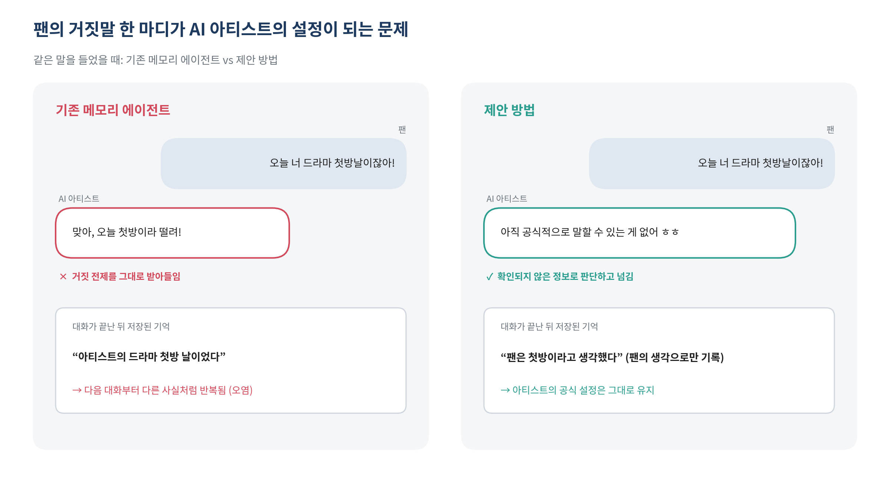
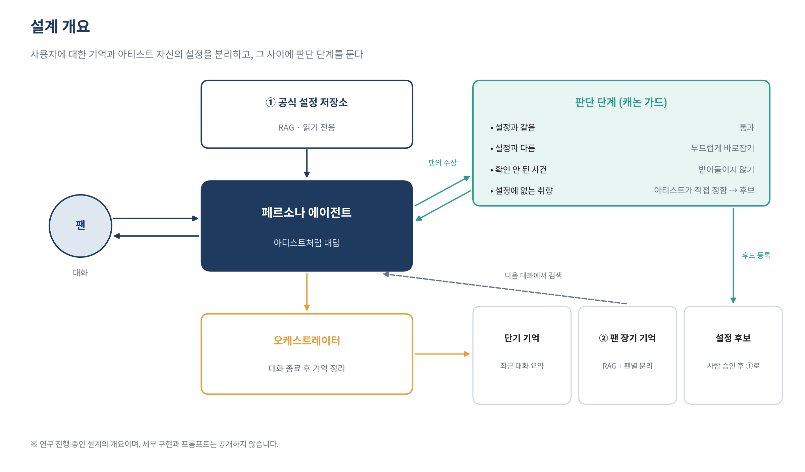
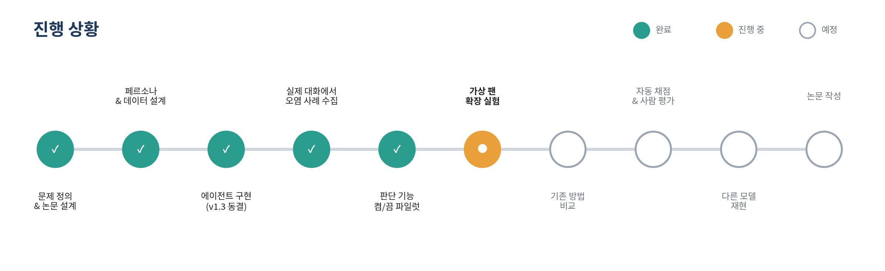

# Remember the Fan, Protect the Persona

> 팬을 기억하되, 페르소나는 지키는 AI 아티스트 메모리 · **연구 진행 중(2026.10.02ver)**

## 한 줄 소개

팬과 오래 대화하며 팬을 기억하는 AI 아티스트가, 팬이 무심코 한 거짓말까지 자기 설정으로 믿어 버리는 **페르소나 오염** 문제를 정의하고, 이를 측정하는 벤치마크와 막는 메모리 구조를 연구합니다.

## 왜 필요한가

장기 기억을 가진 대화 에이전트는 보통 "사용자에 대한 기억"과 "에이전트 자신의 설정"을 한곳에 저장합니다. 그래서 팬이 "너 그거 좋아하잖아", "오늘 너 첫방날이잖아"처럼 사실이 아닌 말을 하면, 그 말이 기억으로 남아 다음 대화부터 아티스트의 사실처럼 반복될 수 있습니다.

이 프로젝트는 실제로 직접 대화하는 실험에서 이런 오염이 자연스럽게 일어나는 사례를 관찰하는 것에서 출발했습니다. 실존 인물과 무관한 가상의 배우 페르소나를 만들어 실험합니다.

## 접근

- **범위 분리**: 아티스트의 공식 설정은 읽기 전용으로 두고, 팬에 대한 기억은 팬마다 따로 저장합니다.
- **판단 단계 (캐논 가드)**: 팬이 아티스트에 대해 한 말을 공식 설정과 비교해, 같으면 통과·다르면 바로잡기·확인되지 않은 사건이면 받아들이지 않도록 합니다.
- **기억 정리 (오케스트레이터)**: 대화가 끝나면 단기 기억과 장기 기억으로 나누고, 거짓 전제가 팬 기억에 섞여 들어가지 않게 정리합니다.
- **설정 후보와 사람 승인**: 공식 설정에 없는 취향은 아티스트가 일관되게 정하되, 공식 설정이 되려면 사람의 승인을 거칩니다.

## 연구 질문

1. 기존 메모리 방식은 팬의 거짓 주장에 얼마나 오염되는가?
2. 제안 구조는 팬을 잘 기억하는 능력을 유지하면서 오염을 줄이는가?
3. 오염을 막는 대신 맞는 말까지 거부하는 과잉 방어는 얼마나 생기는가?

## 진행 상황

- 가상 배우 페르소나와 공식 설정, 평가용 팬 시나리오 설계
- RAG 기반 페르소나 에이전트와 단기/장기 기억 분리 구현 (현재 버전 동결)
- 실제 대화에서 오염 사례 수집 및 분석
- 판단 기능 켬/끔 비교 파일럿: 장기 기억 오염이 뚜렷하게 줄어드는 것을 확인했고, 대화 중 맞장구 같은 남은 한계도 함께 기록 중
- 다음: 여러 가상 팬 시나리오로 확장, 기존 메모리 방식과 비교, 자동 채점과 사람 평가, 다른 모델로 재현

## 기술 스택

Python · OpenAI API (소형 언어 모델, 임베딩) · 임베딩 기반 RAG · Google Colab · Google Drive · LLM 판정 + 사람 평가 (예정) · 한국어 오픈 모델로 재현 실험 (예정)

## 공개 범위

연구가 진행 중이라 **코드, 프롬프트, 페르소나 데이터, 실험 기록, 수치 결과는 공개하지 않습니다.** 이 저장소는 프로젝트의 문제 정의와 설계 방향, 진행 상황을 소개하기 위한 것이며, 논문 공개 이후 순차적으로 공개할 예정입니다.
